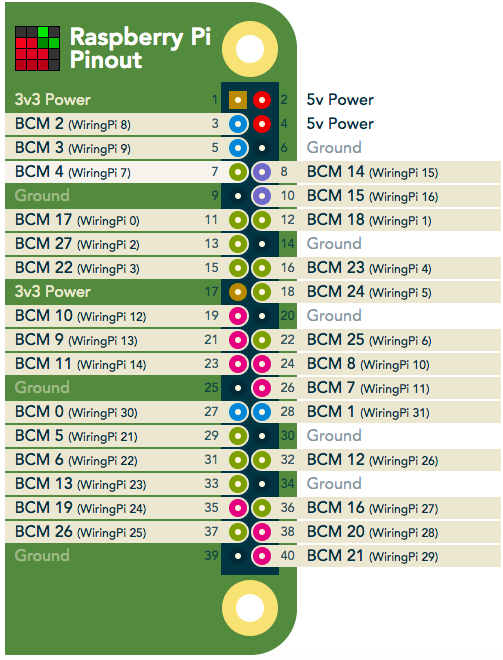

目前所有默认参数都是针对k40的一直针脚全亮模式，以便首次调试时能立即看到效果。

# 修改说明
* 单击桌面上的“雅果配置文件“快捷方式，打开后即可修改;
* 修改相应参数值时":"后要有一个空格` `;
* 如无特殊说明，这里的“针脚”统一指“树莓派针脚”;
* `序号`列也代表参数所在配置文件的行号;
* `参数名`列为灰色框选时表示建议修改项，其它为可选修改项.
* 修改后有如下方式生效
  > 1. 修改参数后要点击保存后关闭此文件；
  > 2. 重启系统，有以下两种方式

# 修改扫描区域
| 序号 | 参数名 | 默认值 | 描述 | 备注 |
| --- | --- | :--- | --- | --- |
| 1| `fobid_x_min` | 0 | 斑马线距离雷达的最小x值 | |
| 2| `fobid_x_max` | 5 | 斑马线距离雷达的最大x值 | |
| 3| `fobid_y_min` | -5 | 斑马线距离雷达的最小y值 | |
| 4| `fobid_y_max` | 5 | 斑马线距离雷达的最大y值 | |

*注*

* 亮灯模式为7/8时无需设置扫描区域.
* 面对`倒装的`雷达，人与雷达两点所在的直线为x方向，左右手所在的(即与x垂直的)直线为y方向;
* x值前负后正，y值左正右负;

# 修改亮灯模式
| 序号 | 参数名 | 默认值 | 描述 | 备注 |
| --- | --- | :--- | --- | --- |
| 5| `light_type` | 8 | 亮灯模式 | |

## 串口跟随
当雷达检测到有人时跟随亮；采用雷达输入，485串口输出。

| 序号 | 参数名 | 默认值/修改值 | 描述 | 备注 |
| --- | --- | :--- | --- | --- |
| 5| `light_type` | 8/0 | 亮灯模式 | |
| 6| `zebra_width` | 1.0 | 斑马线宽度 | |
| 7| `step` | 0 | 斑马线前后跟随条数 | |
| 8| output_comm_type | 1 | 输出通信方式 | 0为模拟通信;1为串口通信|
| 9| output_port | /dev/ttyUSB0 | 输出串口号 | |
| 10| output_baudrate | 9600 | 输出串口波特率 | |

*注*

* 如果`8`号参数设为0时，后面的`9/10`号参数无需设置；
* 后续`参数名`中带有`_comm_type`后缀的都可同上类似操作;

## 串口全亮
当雷达检测到有人时全亮；同样采用雷达输入，485串口输出。

| 序号 | 参数名 | 默认值/修改值 | 描述 | 备注 |
| --- | --- | :--- | --- | --- |
| 5| `light_type` | 8/1 | 亮灯模式 | |
| 8| output_comm_type | 1 | 输出通信方式 | 0为模拟通信;1为串口通信|
| 9| output_port | /dev/ttyUSB0 | 输出串口号 | |
| 10| output_baudrate | 9600 | 输出串口波特率 | |

## 针脚跟随
当雷达检测到有人时跟随亮；采用雷达输入，DAM盒子输出。

| 序号 | 参数名 | 默认值/修改值 | 描述 | 备注 |
| --- | --- | :--- | --- | --- |
| 5| `light_type` | 8/2 | 亮灯模式 | |
| 6| `zebra_width` | 1.0 | 斑马线宽度 | |
| 7| `step` | 0 | 斑马线前后跟随条数 | |
|  | output_pin | 19 | 单元板供电针脚 | |
|  | `gpio_type` | 1/2 | GPIO类型 |1为树莓派针脚;2为DAM盒子 |

## 针脚全亮
当雷达检测到有人时全亮；同样采用雷达输入，DAM盒子输出。

| 序号 | 参数名 | 默认值/修改值 | 描述 | 备注 |
| --- | --- | :--- | --- | --- |
| 5| `light_type` | 8/3 | 亮灯模式 | |

## 针脚半亮
当雷达检测到有人时所在半边车道亮；采用雷达输入，针脚输出。

| 序号 | 参数名 | 默认值/修改值 | 描述 | 备注 |
| --- | --- | :--- | --- | --- |
| 5| `light_type` | 8/4 | 亮灯模式 | |

## 针脚串口全亮
当针脚高电平时全亮；采用针脚开关输入，485串口输出。

| 序号 | 参数名 | 默认值/修改值 | 描述 | 备注 |
| --- | --- | :--- | --- | --- |
| 5| `light_type` | 8/5 | 亮灯模式 | |

## 针脚针脚全亮
当针脚高电平时全亮；采用针脚开关输入，针脚输出。

| 序号 | 参数名 | 默认值/修改值 | 描述 | 备注 |
| --- | --- | :--- | --- | --- |
| 5| `light_type` | 8/6 | 亮灯模式 | |

## 一直串口全亮
一直全亮；采用485串口输出。

| 序号 | 参数名 | 默认值/修改值 | 描述 | 备注 |
| --- | --- | :--- | --- | --- |
| 5| `light_type` | 8/7 | 亮灯模式 | |

## 一直针脚全亮
一直全亮；采用针脚输出。

| 序号 | 参数名 | 默认值/修改值 | 描述 | 备注 |
| --- | --- | :--- | --- | --- |
| 5| `light_type` | 8/8 | 亮灯模式 | |

# 修改针脚
针对树莓派上的某个针脚有问题时，用其它针脚替换；如下图为所有[针脚定义](https://pinout.xyz/)，其中中间数字为针脚编号

*注*

* 替换时需要参考以下针脚图，只能替换成带`WiringPi`字样的针脚;
* 6号针脚为接地，可用9、14、20、25、30、34、39等替换;
* 1、17号针脚提供3.3V电源;
* 2、4号针脚提供5V电源

# 修改雷达

| 序号 | 参数名 | 默认值/修改值 | 描述 | 备注 |
| --- | --- | :--- | --- | --- |
| | laser_type | wr | 主雷达型号 | wr为机智人雷达;k40为k40雷达 |
| | laser_is_standard | true | 主雷达是否为标准精度 | true为标精;false为高精 |
| | second_laser_type | wr | 副雷达型号 | wr为机智人雷达;k40为k40雷达 |
| | second_is_standard | true | 副雷达是否为标准精度 | true为标精;false为高精 |
| | is_zebra_on_x | false | 斑马线是否在x方向上 | true为在;false为不在 |

*注*

* 当主雷达型号为k40时, is_zebra_on_x要设为true

# 修改参数汇总

| 序号 | 参数名 | 默认值 | 描述 | 备注 |
| --- | --- | :--- | --- | --- |
| 1| `fobid_x_min` | 0 | 斑马线距离雷达的最小x值 | |
| 2| `fobid_x_max` | 5 | 斑马线距离雷达的最大x值 | |
| 3| `fobid_y_min` | -5 | 斑马线距离雷达的最小y值 | |
| 4| `fobid_y_max` | 5 | 斑马线距离雷达的最大y值 | |
| 5| zebra_width | 1.0 | 斑马线宽度 | |
| 6| step | 0 | 斑马线前后跟随条数 | |
| 7| `light_type` | 0 | 亮灯模式 | |
| 8| gpio_type | 1 | GPIO类型 |1为树莓派针脚;2为DAM盒子 |
| 9| `laser_type` | wr | 主雷达型号 | wr为机智人雷达;k40为k40雷达 |
| 10| laser_is_standard | true | 主雷达是否为标准精度 | true为标精;false为高精 |
| 11| second_laser_type | wr | 副雷达型号 | wr为机智人雷达;k40为k40雷达 |
| 12| second_is_standard | true | 副雷达是否为标准精度 | true为标精;false为高精 |
| 13| `is_zebra_on_x` | false | 斑马线是否在x方向上 | true为在;false为不在 |
| 14| is_follow | true |  | |
| 15| is_blink | false |  | |
| 16| has_car_light | false | 是否有车照灯 | true为有;false为没有 |
| 17| is_inversion_address | false | 地址码是否装反 | false为没有装反;true为装反 | |
| 18| haz_rviz | true | 是否打开图形界面 | true为打开;false为不打开|
| 19| input_pin | 16 | | |
| 20| second_input_pin | 15 | | |
| 21| laser_power_pin | 18 | | |
| 22| output_pin | 19 | 单元板供电针脚 | |
| 23| second_output_pin | 21 | 针脚 | |
| 24| third_output_pin | 22 | 针脚 | |
| 25| forth_output_pin | 23 | 针脚 | |
| 26| input_interval_seconds | 0.3 | | |
| 27| output_interval_seconds | 0.3 | | |
| 28| input_comm_type | 1 | 第一输入通信方式 | 0为模拟通信;1为串口通信|
| 29| input_port | /dev/ttyUSB1 | 第一输入串口号 | |
| 30| input_baudrate | 9600 | 第一输入串口波特率 | |
| 31| `output_comm_type` | 1 | 第一输出通信方式 | 0为模拟通信;1为串口通信|
| 32| output_port | /dev/ttyUSB0 | 第一输出串口号 | |
| 33| output_baudrate | 9600 | 第一输出串口波特率 | |
| 34| second_output_comm_type | 1 | 第二输出通信方式 | 0为模拟通信;1为串口通信|
| 35| second_output_port | /dev/ttyUSB1 | 第二输出串口号 | |
| 36| second_output_baudrate | 9600 | 第二输出串口波特率 | |
| 37| duration_seconds | 3.0 | 持续亮灯时间 | k40建议设为8.0|
| 38| all_light_sync_seconds | 20.0 | 全亮同步时间| |
| 39| light_duration_seconds | 0.3 | 亮灯时间| |
| 40| dark_duration_seconds | 0.3| 灭灯时间| 频闪时设为0.2|
| 41| reopen_comm_duration_seconds | 1800 | 重启第一串口号时间| |
| 42| start_seconds | 0.2 | 单元板上电等待时间 | |
| 43| light_seconds | 3.0 | | |
| 44| light_unit | 1.0 | | |
| 45| second_x | 0.0 |  | |
| 46| second_y | 0.0 |  | |
| 47| core_type | 1 | 加密类型 | 0为不使用加密狗;1为飞天加密狗|
| 48| server_address | 127.0.0.1 | 后台服务器地址 | |
| 49| server_port | 9000 | 后台服务器端口号 | |
| 50| position_x | 0.0 | 设备所在经度 | |
| 51| position_y | 0.0 | 设备所在纬度 | |
| 52| dev_id | "0" | 设备ID | |
| 53| frame_size | 6 | k40取点个数 | |
| 54| arrow_skip_frame | 2 |  | |
| 55| flash_figure | 0 | 轮闪花样 | |
| 56| valid_start_count | 3 |  | |
| 57| same_body_speed_limit | 2.5 |  | |
| 58| min_velocity | 0.3 |  | |
| 59| max_velocity | 3.0 |  | |
| 60| min_cross_angle | -25.0 |  | |
| 61| max_cross_angle | 25.0 |  | |
| 62| min_body_size | 0.2 |  | |
| 63| max_body_size | 0.6 |  | |
| 64| angle_limit_min | -180.0 |  | |
| 65| angle_limit_max | 180.0 |  | |
| 66| start_min_velocity | 1.5 |  | |
| 67| start_max_velocity | 11.11 |  | |
| 68| C0 | 0.05 |  | |
| 69| C1 | 1.7 |  | |
| 70| maxInterval | 1.0 |  | |
| 71| beta | 60.0 |  | |
| 72| axes_rotate | 0.0 |  | |
| 73| enable_break_detc | false |  | |
| 74| serial_topic_name | "serial_msg" | | |
| 75| zebra_frame_id | "zebra_frame" | | |
| 76| pos_topic_name | "pos_cells" | | |
| 77| frequency | 5.0 |  | |
| 78| send_count | 1| 串口重发次数 | | |
| 79| address_count | 2| 一条斑马线占用地址码个数 | | |
| 80| zebra_show | 0.55 |  | |
| 81| near_split_count | 0.5 | | |
| 82| side_split_count | 0.25| | |
| 83| chip_type | v2 | 芯片版本 | v1为卢总带主控板版本;v2为卢总当前版本;v3为方工版本|
